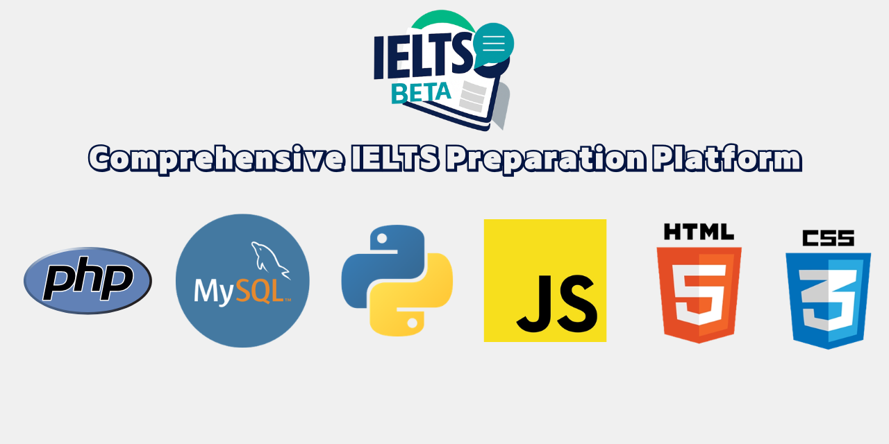

# 🎓 IELTS Beta

> 📖 **Looking for the User Guide?** [Click here to view the User Guideline.](./User_Guide.md)

---

IELTS Beta is a comprehensive, full-stack preparation platform that combines traditional mock testing with cutting-edge AI tutoring. Built with a robust PHP backend and a sophisticated Python-based AI engine.



---

## 🚀 Key Features

- **🤖 AI Tutor (LangGraph + Groq):** Get instant feedback on Writing Task 2 essays and real-time answers to IELTS-related questions.
- **🃏 3D Word Bank:** Master 200+ academic words with interactive 3D flashcards and custom word management.
- **📝 Mock Test Suite:** Simulate computer-based IELTS exams with automated scoring and performance tracking.
- **📊 Progress Dashboard:** Visualise your improvement across Listening, Reading, Writing, and Speaking with dynamic charts.
- **🔐 Hybrid Auth:** Seamless Google Sign-In via Firebase, integrated with local session management.

---

## 🛠️ Tech Stack

### Frontend & UI
- **Languages:** HTML5, CSS3 (Custom Design System), Vanilla JavaScript
- **Auth:** Firebase Authentication (Google OAuth)
- **Design:** Sora & DM Sans Typography, 3D CSS Transformations

### Backend & API
- **Language:** PHP 8.1+ (PDO, Sessions)
- **Database:** MySQL 8.0+
- **Security:** CSRF Protection, Password Hashing, Session Validation

### AI Engine (The "Brain")
- **Framework:** Python (FastAPI, LangGraph)
- **LLM:** Llama 3.3-70b (via Groq)
- **Tools:** Tavily Search API (for real-time web data)
- **Persistence:** SQLite (for conversation memory)

---

## 📸 Screenshots

| Dashboard | AI Tutor | Flashcards |
|:---:|:---:|:---:|
|  |  |  |

---

## ⚙️ Setup & Installation

### 1. Database Setup
Import the schema and initial content into your MySQL server:
```bash
mysql -u root -p < database.sql
mysql -u root -p < real_content.sql
```

### 2. PHP Configuration
1. Rename `includes/env.example.php` to `includes/env.php`.
2. Update your database credentials and Firebase project details.

### 3. AI Tutor Setup (Optional but Recommended)
Navigate to the `chatbot` directory and set up the environment:
```bash
cd chatbot
pip install -r requirements.txt
# Create .env with GROQ_API_KEY and TAVILY_API_KEY
uvicorn api:app --reload --port 8000
```

### 4. Running the App
Place the project in your local server root (e.g., XAMPP `htdocs`) and navigate to:
`http://localhost/ielts_beta_v3/pages/home.php`

---

## 📄 Documentation
- [User Guide](./User_Guide.md)
- [Code Walkthrough](./Code_Walkthrough.md)
- [Chatbot Readme](./chatbot/README.md)
