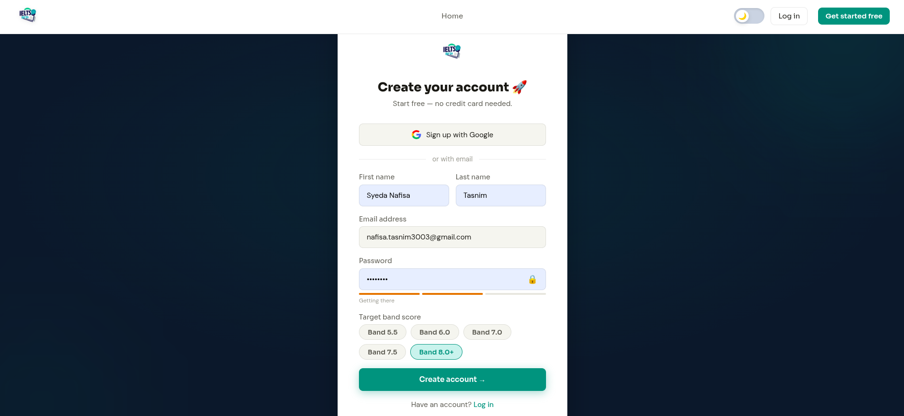
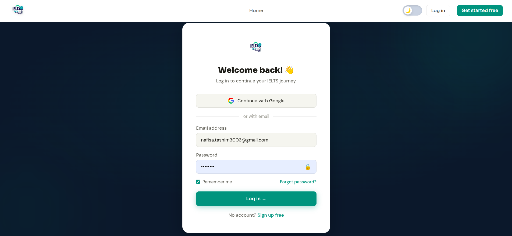
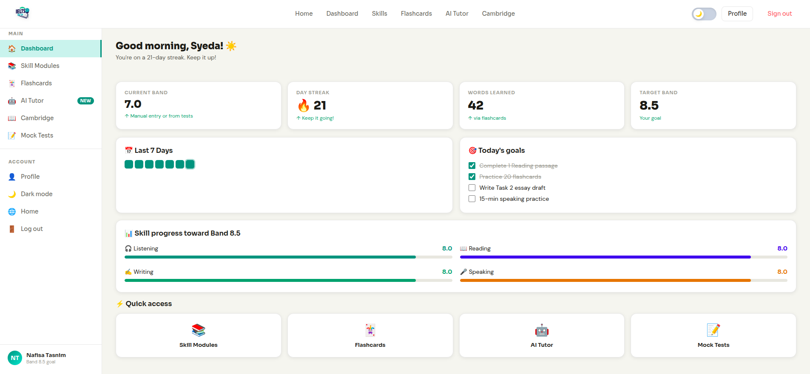
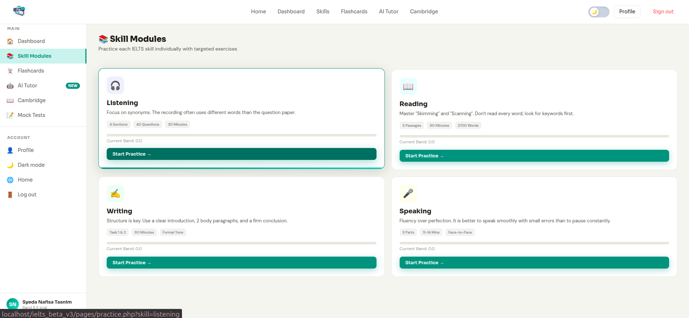
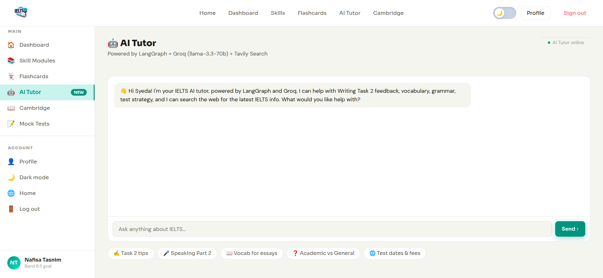
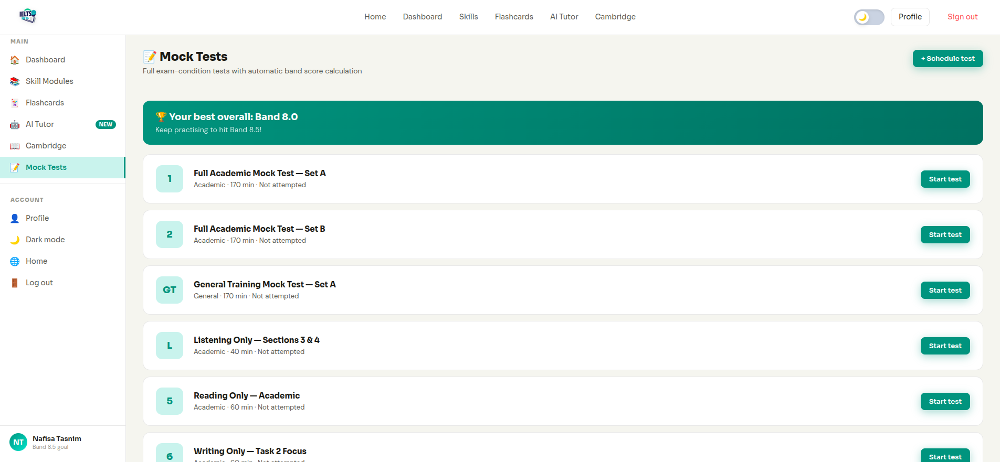

# 📘 User Guideline: Getting Started with IELTS Beta

Welcome to **IELTS Beta**! This guide is designed for students and preparation seekers. It explains how to use every part of the platform to maximize your study efficiency and reach your target band score.

---

## 🚀 1. The Journey Begins: Landing Page

The Landing Page is your first stop. Here you can see an overview of our features, current statistics of successful students, and quick links to get started.
- **Get Started:** Click the main button to jump straight into the login or signup flow.
- **Explore Features:** Scroll down to see what makes our AI Tutor and Mock Tests different.

---

## 🔐 2. Joining & Accessing
### **Sign Up Page**

Create your account in seconds. We recommend setting your **Target Band Score** during registration so the platform can tailor your progress charts immediately.
- **Social Sign-In:** Use your Google account for a one-click setup.

### **Login Page**

Access your personalized study space. If you used Google to sign up, simply click the Google button again.
- **Stay Logged In:** The platform remembers your session so you don't have to log in every time.

### **Forgot Password?**

If you forget your password, click the "Forgot Password?" link on the login page. Enter your email, and we will send you a secure link to reset it.

---

## 📊 3. Your Study Hub: The Dashboard

After logging in, you'll arrive at the Dashboard. This is your mission control.
- **Streak Tracker:** See how many days in a row you've studied. Don't break the chain!
- **Skill Progress Bars:** Watch your Listening, Reading, Writing, and Speaking scores grow toward your target.
- **Daily Goals:** A checklist of tasks to complete today to stay on track.

---

## 📚 4. Core Study Modules
### **Skill Modules**

Focus on specific areas of the IELTS exam. Each module (Speaking, Writing, Reading, Listening) contains targeted exercises and strategies.

### **AI Tutor (24/7 Expert)**

Chat with our intelligent tutor. 
- **Essay Grading:** Paste your Task 2 essays for instant feedback.
- **Live Search:** Ask about "Latest test fees in my city" or "Next test dates" — the AI searches the web for you!

### **Vocabulary Word Bank (Flashcards)**

Master over 200+ academic words. 
- **3D Interactive Cards:** Click to flip and see definitions.
- **Create Your Own:** Add custom words you encounter during your reading.

### **Cambridge Resources**

Access a curated library of official Cambridge preparation materials, including PDFs, audio files, and practice books.

---

## 📝 5. Exam Simulation: Mock Tests
### **Mock Test Selection**

Choose from a variety of full-length mock tests. These are designed to mimic the difficulty of the actual exam.

### **Taking the Test**

Enter a distraction-free testing environment. A timer helps you manage your pace, just like the real exam.

### **Instant Results**

Immediately after finishing, see your estimated band score and a breakdown of which questions you got right or wrong.

---

## 👤 6. Managing Your Profile

Update your personal details, change your profile picture, or adjust your target band score as you improve.
- **Achievements:** View badges you've earned for consistent study and high scores.

---

## 🚪 7. Logging Out
To keep your data secure, especially on shared computers, always remember to Log Out. You can find the Logout button at the bottom of the sidebar or inside your Profile menu.

---

## 📱 8. Mobile & Tablet Experience

IELTS Beta is built to be **fully responsive**. You can study on the go!
- **Adaptive Layout:** On screens smaller than **980px**, the sidebar collapses into a convenient mobile menu.
- **Touch Friendly:** All 3D flashcards and interactive elements are optimized for tapping and swiping on tablets and smartphones.
- **Study Anywhere:** Whether you're on a bus or at a desk, your progress stays synced across all devices.

---
*Good luck with your preparation! Your target band score is within reach.*
